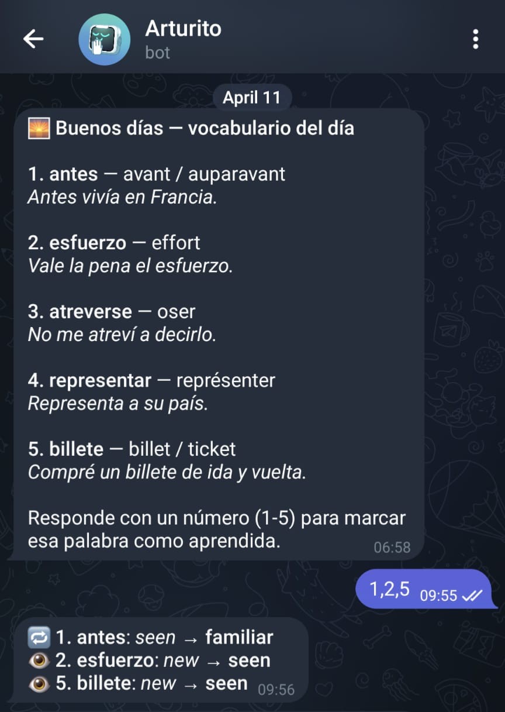
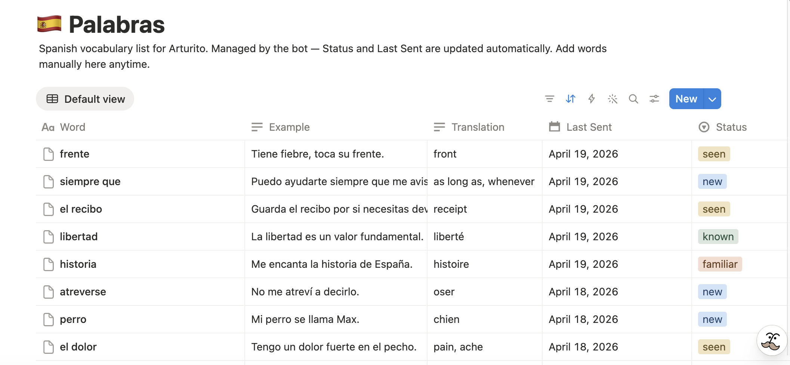

# Arturito

A personal Telegram bot that delivers daily Spanish vocabulary using spaced repetition. Twice a day, it picks words from a Notion database (Palabras), sends them to your phone, and tracks your progress as you interact with it.

Built with Python, cron, systemd, Telegram Bot API, and Notion.

*Telegram bot*



---

*Notion DB*



## Stack

| Layer | Technology |
|---|---|
| Language | Python 3 |
| Scheduler | cron |
| Long-running service | systemd |
| Telegram | Telegram Bot API (long polling) |
| Database | Notion API via `notion-client` |
| Deploy | GitHub Actions + SSH |
| Hosting | VPS |

---

## Features

- Sends 5 Spanish words at 08:00 and 20:00 (configurable)
- Weighted word selection: new words appear more frequently than familiar ones
- Cooldown system: words are spaced out based on their current status
- Reply with a number to advance a word's status (e.g. `1`, `3,5`)
- Vocab database lives in Notion, editable from any device without SSH
- Auto-deploy via GitHub Actions on every push to `main`

---

## Architecture

Two scripts, two lifecycles, one shared state layer.

```
┌─────────────────────────────────────────────────────────────────┐
│                             VPS                                 │
│                                                                 │
│   cron (08:00 / 20:00) ──────────────► send_vocab.py            │
│                                              │                  │
│                               1. Query eligible words           │
│                               2. Pick 5 words (weighted)        │
│                               3. Send Telegram message          │
│                               4. Write session.json             │
│                               5. Update Last Sent in Notion     │
│                                                                 │
│   systemd service (always-on)                                   │
│   bot_listener.py  ◄──── long-polls Telegram API                │
│          │                                                      │
│    Reply "2" or "1,3"                                           │
│          │                                                      │
│    Reads session.json ──► looks up Notion page ID               │
│    Calls Notion API ───► bumps word Status                      │
│                                                                 │
│   ┌──────────────┐                                              │
│   │ session.json │  shared state between the two scripts        │
│   │ offset.txt   │  Telegram update checkpoint                  │
│   │ .env         │  secrets (never committed)                   │
│   └──────────────┘                                              │
└─────────────────────────────────────────────────────────────────┘
         │                                      │
         ▼                                      ▼
┌─────────────────┐                  ┌──────────────────────┐
│   Notion API    │                  │    Telegram API      │
│  Palabras DB    │                  │  Bot sends messages  │
│                 │◄─────────────────│  You reply with pos. │
│  Word / Status  │  Status updates  │  number (1-5)        │
│  Last Sent ...  │                  │                      │
└─────────────────┘                  └──────────────────────┘
```

### `send_vocab.py` (cron-managed)

Runs and exits. Queries the Notion Palabras database, filters out `known` words and anything still in cooldown, picks 5 words using weighted random selection, sends the Telegram message, writes `session.json`, and updates `Last Sent` in Notion.

### `bot_listener.py` (systemd-managed)

Runs forever. Long-polls the Telegram API for replies. When a number (or comma-separated list like `1,3,5`) comes in, it reads `session.json` to resolve positions to Notion page IDs, bumps each word's status by one step, and replies with a confirmation.

### Shared state

`session.json` is the bridge: `send_vocab.py` writes it after each send, `bot_listener.py` reads it on each reply. Notion is the persistent store; local files are ephemeral working state.

---

## Status Progression

Words move through four stages. The script never sends `known` words, they can be removed from Notion manually.

| Status | Cooldown before resend | Weight in pick |
|---|---|---|
| `new` | none | 10 |
| `seen` | 3 days | 4 |
| `familiar` | 7 days | 1 |
| `known` | never sent | - |

Each reply bumps a word one step: `new` -> `seen` -> `familiar` -> `known`.

---

## Database Structure (Palabras)

Hosted in Notion, editable from any device without touching the server.

| Field | Type | Description |
|---|---|---|
| `Word` | Title | The Spanish word or phrase |
| `Translation` | Text | English or French translation |
| `Example` | Text | Example sentence in context |
| `Status` | Select | `new` / `seen` / `familiar` / `known` |
| `Last Sent` | Date | Updated on each send, used for cooldown logic |
| `Tags` | Multi-select | `verb`, `noun`, `adjective`, `adverb`, `phrase`, `common` |
| `ID` | Auto ID | Auto-incremented identifier for each word |

---

## CI/CD

Code is pushed from a local machine to GitHub. A GitHub Actions workflow SSHs into the VPS and runs `git pull` on every push to `main`.

```
Local machine  ->  git push  ->  GitHub  ->  Actions workflow  ->  SSH into VPS  ->  git pull + systemctl restart
```

The VPS is read-only from a git perspective (it only ever pulls, never pushes).

- `send_vocab.py` is cron-triggered and picks up new code automatically on the next scheduled run.
- `bot_listener.py` requires a service restart to pick up changes, handled automatically by the workflow.
- Runtime files (`session.json`, `offset.txt`, `.env`) are gitignored and never touched by deploys.

---

## Setup

### 1. Telegram

1. Open Telegram and search for `@BotFather`
2. Run `/newbot`, follow the prompts, and save the **Bot API token**
3. Start a chat with your bot and retrieve your **Chat ID** (via `@userinfobot` or the Telegram API)

### 2. Notion

1. Go to [notion.so/my-integrations](https://notion.so/my-integrations) and create a new integration
2. Save the **Integration Token**
3. Open the Palabras database in Notion, go to Share, and invite your integration
4. Copy the **Database ID** from the URL

### 3. VPS

```bash
# Clone the repo
git clone https://github.com/YOUR_USER/arturito.git /home/ubuntu/arturito
cd /home/ubuntu/arturito

# Install dependencies
pip install notion-client pytz requests --break-system-packages

# Create the .env file (see .env.example)
cp .env.example .env
nano .env
```

### 4. Environment variables

```bash
# .env
NOTION_TOKEN=secret_xxxx
NOTION_DATABASE_ID=xxxx
TELEGRAM_TOKEN=xxxx:xxxx
TELEGRAM_CHAT_ID=xxxx
```

### 5. Cron jobs

```bash
crontab -e
```

```
SHELL=/bin/bash
# (adjust UTC offset for your timezone and daylight saving)
0 20 * * * set -a; source /home/ubuntu/arturito/.env; set +a; python3 /home/ubuntu/arturito/send_vocab.py >> /home/ubuntu/arturito/send_vocab.log 2>&1
0 8  * * * set -a; source /home/ubuntu/arturito/.env; set +a; python3 /home/ubuntu/arturito/send_vocab.py >> /home/ubuntu/arturito/send_vocab.log 2>&1
```

### 6. Systemd service

Create `/etc/systemd/system/arturito-listener.service`:

```ini
[Unit]
Description=Arturito bot listener
After=network.target

[Service]
EnvironmentFile=/home/ubuntu/arturito/.env
ExecStart=/usr/bin/python3 /home/ubuntu/arturito/bot_listener.py
WorkingDirectory=/home/ubuntu/arturito
Restart=always
User=ubuntu

[Install]
WantedBy=multi-user.target
```

```bash
sudo systemctl daemon-reload
sudo systemctl enable arturito-listener
sudo systemctl start arturito-listener
```

### 7. Allow the deploy user to restart the service without a password

```bash
echo "ubuntu ALL=(ALL) NOPASSWD: /bin/systemctl restart arturito-listener" \
  | sudo tee /etc/sudoers.d/arturito
```

---

## Debugging

```bash
# Check cron is scheduled
crontab -l

# Watch cron execution in real time
tail -f /var/log/syslog | grep CRON

# Watch send_vocab output
tail -f /home/ubuntu/arturito/send_vocab.log

# Check listener status
sudo systemctl status arturito-listener

# Restart listener
sudo systemctl restart arturito-listener
```
